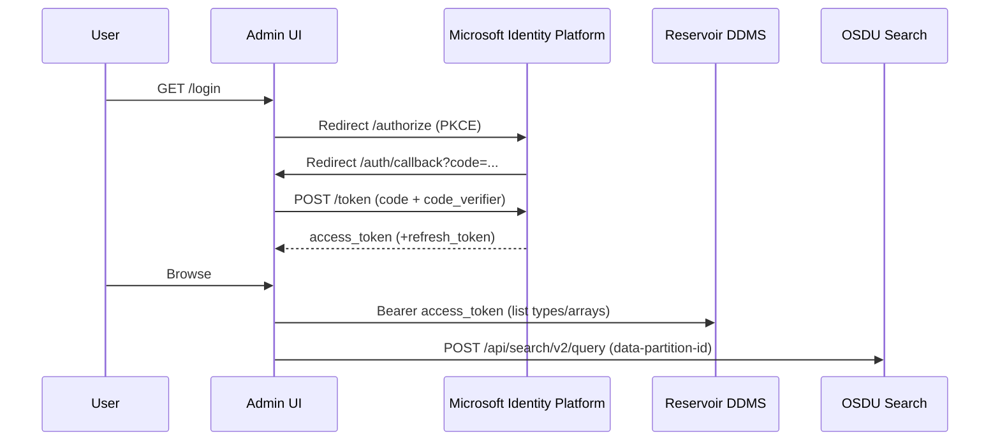
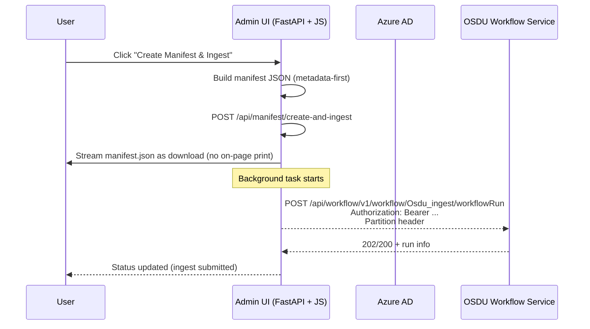

# OSDU RDDMS admin ui web client


## Install and run

Auth: 
store your adme refresh_token as env variable or in .env file

Requires: 
python libs: uvicorn fastapi httpx jinja2 numpy multipart

Call:
py -m uvicorn app.main:app --reload --port 8000 --env-file .\\.env

open http://127.0.0.1:8000/


### File Architecture 

```
rddms-admin/
├─ requirements.txt
├─ .env
└─ app/
   ├─ main.py
   ├─ auth.py
   ├─ osdu.py
   ├─ templates/
   │  ├─ base.html
   │  ├─ index.html
   │  ├─ dataspace.html
   │  ├─ keys.html
   │  ├─ resource.html
   │  ├─ create.html
   │  ├─ _fragments.html
   |  └─ search.html
   └─ static/
      └─ app.js
```

### Auth Sequence Diagram



### Manifest Ingestion Sequence Diagram


